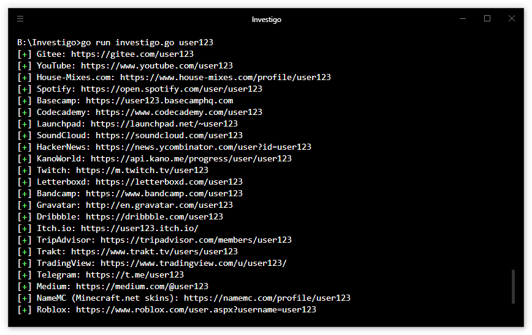

# Overview


[](https://opensource.org/licenses/MIT)
[](https://github.com/tdh8316/Investigo/stargazers)

+ [English](./README.MD) 
  
  [한국어](./README-ko_kr.MD)

*Investigo* is the `Go` implementation of *[Sherlock](https://sherlock-project.github.io/)*.

Investigo supports [several Social Media](./sites.md).



# Download Windows Binary
You can download the latest version of investigo.
 - [Releases](https://github.com/tdh8316/Investigo/releases)

# Usage
`$ investigo.exe USERNAMES... [--verbose] [--disable-color] [--site NAME]`
## Build from source
To compile investigo, Go 1.8 or higher is required.
```
$ git clone https://github.com/tdh8316/Investigo.git
$ cd investigo
$ go run investigo.go USERNAMES... [--verbose] [--disable-color] [--site NAME]
```

## Optional Arguments
```
Investigo - Investigate User Across Social Networks.

Usage: go run investigo.go [-h] [--no-color] [--verbose] [--update] [--site SITE_NAME] USERNAMES

 positional arguments:
        USERNAMES          Usernames to investigate

 optional arguments:
        --site             Specify sites to search. (e.g --site github)
        --disable-color
        --verbose          Print sites USERNAME is not found.
        --update           Update list automatically
```

# License
Licensed under the MIT License

Copyright 2019 Donghyeok Tak
