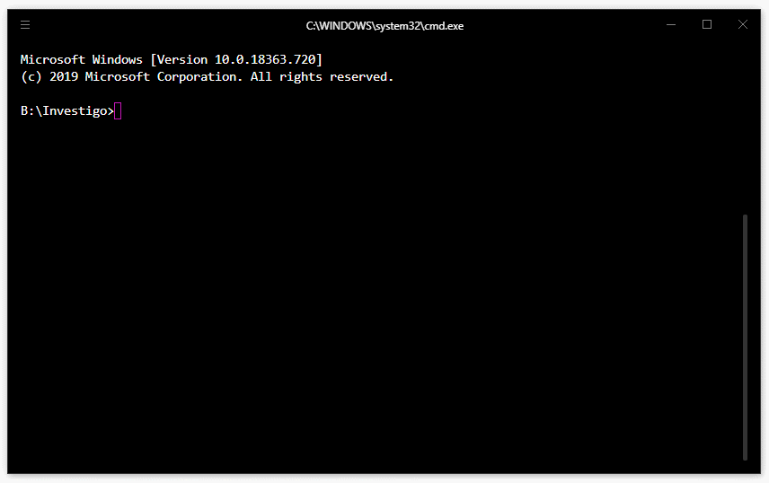

# Overview

<p align="center">
	    <a href="https://github.com/tdh8316/Investigo" alt="Commits"></a>
	    <a href="https://github.com/tdh8316/Investigo" alt="Go"></a>
	    <a href="https://opensource.org/licenses/MIT" alt="License: MIT"></a>
	    <a href="https://github.com/tdh8316/Investigo/stargazers" alt="GitHub stars"></a>
		<a href="https://travis-ci.com/tdh8316/Investigo" alt="Travis-CI"></a>
		<a href="https://twitter.com/intent/tweet?text=WoW:&url=https%3A%2F%2Fgithub.com%2Ftdh8316%2FInvestigo" alt="Twitter"></a>
</p>

<p align="center">
    <a href="https://github.com/tdh8316/Investigo" alt="github all releases"></a>
    <a href="https://github.com/tdh8316/Investigo" alt="github latest release"></a>
    <a href="https://github.com/tdh8316/Investigo" alt="github tag"></a>
    <a href="https://github.com/tdh8316/Investigo" alt="github release"></a>
    <a href="https://github.com/tdh8316/Investigo" alt="github pre release"></a>
    <a href="https://github.com/tdh8316/Investigo" alt="github fork"></a>
    <a href="https://github.com/tdh8316/Investigo" alt="github stars"></a>
    <a href="https://github.com/tdh8316/Investigo" alt="github watchers"></a>
    <a href="https://github.com/tdh8316/Investigo" alt="github open issues"></a>
    <a href="https://github.com/tdh8316/Investigo" alt="github closed issues"></a>
    <a href="https://github.com/tdh8316/Investigo" alt="github open pr"></a>
    <a href="https://github.com/tdh8316/Investigo" alt="github closed pr"></a>
    <a href="https://github.com/tdh8316/Investigo" alt="github contributors"></a>
    <a href="https://github.com/tdh8316/Investigo" alt="github license"></a>
    <a href="https://gitter.im/tdh8316/Investigo" alt="gitter chat room"></a>
    <a href="https://travis-ci.com/tdh8316/Investigo" alt="travis badge"></a>
</p>

+ [English](./README.MD) 
  
  ~~[한국어](./README-ko_kr.MD)~~

*Investigo* is a command-line tool written in `Go` for searching usernames on [social media](./sites.md).



# Installation
## Download Windows Binary
You can download the binary for Windows.
 - [Download latest release](https://github.com/tdh8316/Investigo/releases)

`$ investigo.exe -h`

## Build from source
To compile investigo, Go 1.8 or higher is required.

```cmd
$ git clone https://github.com/tdh8316/Investigo.git
$ cd investigo
$ go get github.com/fatih/color
$ go run investigo.go -h
```

## Build with docker
If you don't have Docker/Docker-Compose check **Setup Docker** section

<details>
<summary><b>Setup Docker</b></summary>
<p>

## Docker
macOS: <a href="https://docs.docker.com/docker-for-mac/install/"> https://docs.docker.com/docker-for-mac/install/ </a>

linux: <a href="https://docs.docker.com/install/linux/docker-ce/ubuntu/"> https://docs.docker.com/install/linux/docker-ce/ubuntu/ </a>

## Docker Compose

linux: <a href="https://docs.docker.com/compose/install/"> https://docs.docker.com/compose/install/ </a>
</p>
</details>

### Investigo (standalone mode)

<details>
<summary><b>Example run investigo standalone with docker</b></summary>
<p>
	<code> 
		$ docker run x0rzkov/investigo:latest investigo -s tdh8316
	</code>
</p>
</details>

<details>
<summary><b>Example run investigo standalone with docker-compose</b></summary>
<p>
	<code> 
		$ docker-compose run investigo investigo -h
	</code>
</p>
</details>

### Investigo (headless chromium mode)

<details>
<summary><b>Example run investigo standalone with docker</b></summary>
<p>
	<code> 
		$ docker run -v $(pwd)/data:/screenshots x0rzkov/investigo-chromium:latest -s tdh8316
	</code>
</p>
</details>

<details>
<summary><b>Example run investigo chromium with docker-compose</b></summary>
<p>
	<code> 
		$ docker-compose run investigo-chromium -s tdh8316
	</code>
</p>
</details>

# Usage
```cmd
$ investigo [-h] [--no-color] [-v|--verbose] [-t|--tor] [--update] USERNAME [USERNAMES...]
positional arguments:
	USERNAMES             one or more usernames to investigate

optional arguments:
	-h, --help			  show this help message and exit
	-v, --verbose         output sites which is username was not found
	--no-color            disable colored stdout output
	--update              update datebase from github.com/tdh8316/investigo/
```

# Why Investigo?
Investigo is trying to build our own database while keeping compatibility with Sherlock.
This is because even though Sherlock project contains a vast database, adult sites are forbidden.

Furthermore, Investigo is more than twice as fast as the original implementation!

# TODO
## Manifesto
Investigo is another implementation of Sherlock. Accordingly, I would like not to make a competition with Sherlock.

 - [ ] Avoid deep packet inspection
 - [x] Support Tor
 - [ ] Implement regex check
 - [x] Command-line arguments
 - [x] Add tests

## Become a stargazer
★

# Addding/Fixing site
Investigo uses Sherlock's database.

## To add sites...
If you want to add sites to Investigo, make a Pull Request to [Sherlock project](https://github.com/sherlock-project/sherlock). Or if you want to add prohibited sites for Sherlock, make an issue or a Pull Request to this repository!

## To fix incompatible sites...
Make an issue [here](https://github.com/sherlock-project/sherlock/issues) to let Sherlock developers know.

# License
Licensed under the MIT License

Copyright 2019 Donghyeok Tak
